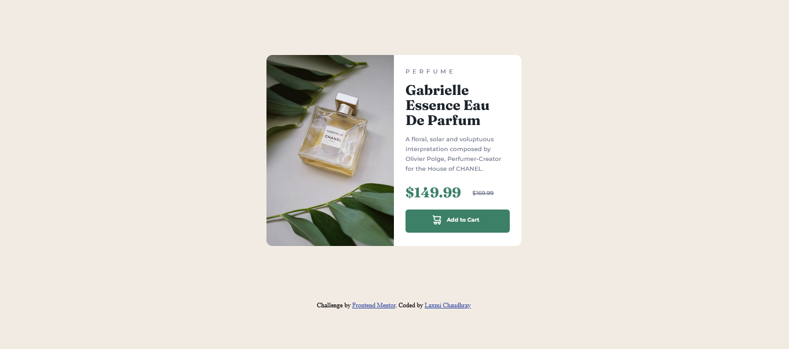

# Frontend Mentor - Product preview card component solution

This is a solution to the [Product preview card component challenge on Frontend Mentor](https://www.frontendmentor.io/challenges/product-preview-card-component-GO7UmttRfa). Frontend Mentor challenges help you improve your coding skills by building realistic projects. 

## Table of contents

- [Overview](#overview)
  - [The challenge](#the-challenge)
  - [Screenshot](#screenshot)
  - [Links](#links)
- [My process](#my-process)
  - [Built with](#built-with)
  - [What I learned](#what-i-learned)
  - [Continued development](#continued-development)
  - [Useful resources](#useful-resources)
- [Author](#author)
- [Acknowledgments](#acknowledgments)


## Overview

### The challenge


- View the optimal layout depending on their device's screen size
- See hover and focus states for interactive elements

### Screenshot





### Links

- Solution URL: (https://www.frontendmentor.io/challenges/qr-code-component-iux_sIO_H/hub/qr-code-component-solution-using-html-and-css-stylesheet-KcvIRzUr4A)
- Live Site URL:(https://ltc01.github.io/FrontendMentor/)

## My process

### Built with

- Semantic HTML5 markup
- CSS custom properties
- Flexbox
- CSS Grid
- Mobile-first workflow


### What I learned


```html
      <h2>$149.99</h2><span>$169.99</span>
```
```css
@media (max-width:375px) {

    .image {
        border-top-right-radius: 10px;
        border-bottom-left-radius: unset;
       
    }
```


### Continued development
 - Media query
 - box model

### Useful resources
- Google developers tool

## Author

- Website -(Laxmi Chaudhary)(https://ltc01.github.io/FrontendMentor/)
- Frontend Mentor - [@ltc01](https://www.frontendmentor.io/profile/ltc01)

